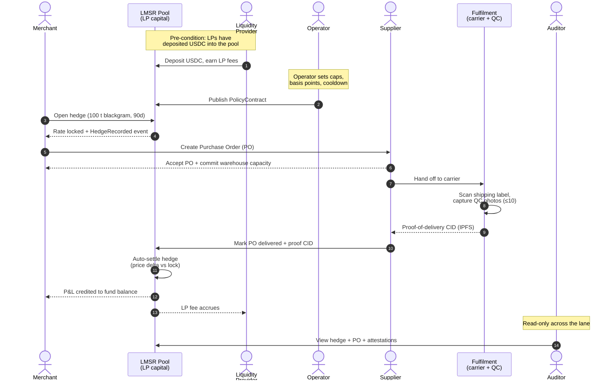
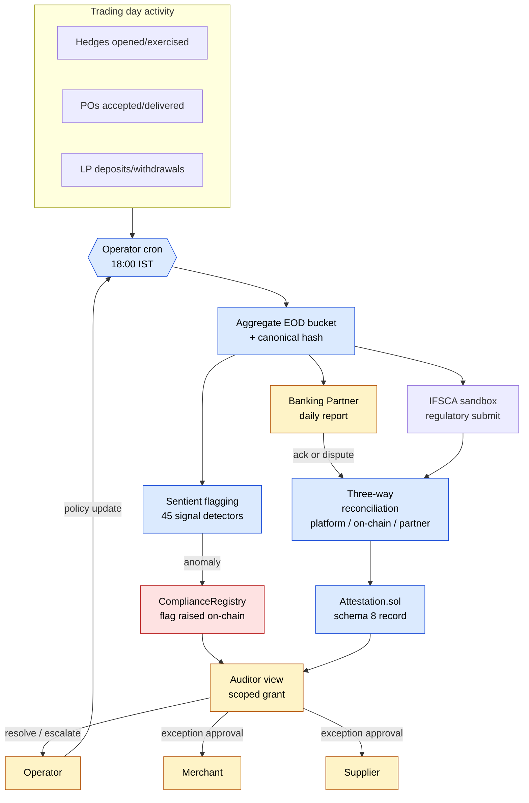

# OkinawaTrader — Stakeholder Flow Diagrams

**Last refreshed:** 2026-04-30
**Purpose:** A high-level case-study view of how the six stakeholders
(Merchant, Supplier, LP, Operator, Auditor, Banking Partner) plus the
Fulfilment lane interact across two typical workflows. For implementation
detail see `STAKEHOLDER_ACTIONS_AND_STATUS.md`.

---

## Case study

A merchant in Mumbai wants to lock in a price for **100 t of blackgram**
delivered from a Madhya Pradesh supplier in 90 days. The platform turns
that single intent into:

- a hedged on-chain price (Workflow 1), and
- a continuously audited, dual-ledger settlement record (Workflow 2).

The two diagrams below trace exactly that journey end-to-end.

---

## Workflow 1 — Hedge → Purchase Order → Delivery

The merchant locks a price on the LMSR pool, books a real purchase order
against a supplier, and the goods physically move through the fulfilment
lane until on-chain settlement. The Operator sets the policy guardrails;
the Auditor watches the trail.

**What the diagram shows at a glance**

The merchant never touches the LP capital directly — the pool is the
counterparty. Fulfilment is a discrete swimlane (carrier scan + QC
photos) so an off-chain physical event produces an on-chain settlement
trigger. The Operator only writes policy; they don't approve individual
trades. The Auditor has scoped read access and never blocks the flow.

---

## Workflow 2 — End-of-Day Settlement, Compliance & Dual-Ledger Oversight

Every trading day, the platform reconciles its books against a Banking
Partner (regulatory second source of truth) and against IFSCA. Sentient
detectors raise flags on anomalies; the Auditor adjudicates.

**What the diagram shows at a glance**

Every day the platform must agree with two outside parties — the Banking
Partner and IFSCA — and emit a hashed attestation when they reconcile.
Sentient is not a person; it's an automated detector layer that promotes
anomalies into compliance flags. The Auditor is the human in the loop
who closes flags or grants exceptions; the Operator only reacts by
tightening policy on the next cycle. This is what makes the platform
defensible to a regulator: nobody — not even the Operator — can settle
without the dual ledger agreeing.

---

## How to read the two diagrams together

Workflow 1 is **a single trade's journey** through the system.
Workflow 2 is **what happens to every trade by the close of the day**.
Together they cover the merchant intent (lock a price, get the goods)
and the institutional layer (dual ledger, attestations, audit) that
makes the platform shippable to a regulated commodity market.
# okinawatrader-v4
